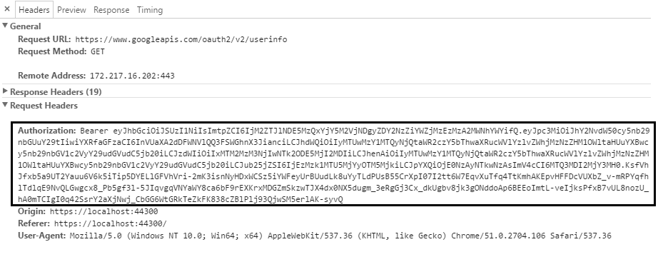

[](https://travis-ci.org/matik12/aurelia-oauth)

[**Contributors needed**: I'm looking for people that are willing to help me maintain and improve this plugin.](https://github.com/matik12/aurelia-oauth/issues/1)

---

#### NPM package [aurelia-oauth](https://www.npmjs.com/package/aurelia-oauth)
#### Setup using Google API -> [Live demo](https://matik12.github.io/aurelia-basic-app-skeleton/)

## What is aurelia-oauth plugin?
aurelia-oauth is a plugin for [Aurelia](http://aurelia.io/) to provide support of user authorization using OAuth 2.0 Authorization Framework. 

aurelia-oauth has very similar functionality as [ADALjs library] (https://github.com/AzureAD/azure-activedirectory-library-for-js) and can be easily configured to integrate with OAuth2 APIs such as Azure Active Directory, Google etc.

aurelia-oauth plugin automatically uses 'Bearer' JWT (JSON WEB TOKEN) tokens to send requests to secured APIs by adding Authorization header. The underlying token is **never stored** on the client due to sensitive data security. Use this page - [JWT](https://jwt.io/) to decode tokens and investigate claims.   



This plugin implements only **OAuth implicit grant flow**, which is the recommended approach for both client side SPA applications and mobile apps. In this case, application does not need to supply login page and can leverage external login page with Single Sign-On. Plugin relies on simple page redirects(**no popups!**) and therefore can be seamlessly used on mobile devices. Animation below shows plugin and its flow in action.


# Installation prerequisites
Obviously, you need to have installed [NodeJs](https://nodejs.org/) and [Gulp](http://gulpjs.com/). aurelia-oauth was based on [Aurelia plugin](https://github.com/aurelia/skeleton-plugin) and requires only standard Aurelia libraries. It's highly recommended to use JSPM for package managment.

# Installation
```
jspm install aurelia-oauth
```
Using Npm:
```
npm install aurelia-oauth --save
```
Using typescript you can install definitions:
```
typings install github:matik12/aurelia-oauth --save
```

# Usage guide

## Update the Aurelia configuration file

In your Aurelia configuration file(most commonly main file) add the plugin and provide OAuth endpoint configuration :
```js
// Uncomment import for client plugin you want to use i.e. fetch or http
// import { HttpClient } from 'aurelia-http-client';
// import { HttpClient } from 'aurelia-fetch-client';

export function configure(aurelia: Aurelia) {
  const httpClient = <HttpClient>aurelia.container.get(HttpClient);

  aurelia.use
    .standardConfiguration()
    .developmentLogging()
    .plugin('aurelia-oauth', (oauthService, oauthTokenService, configureClient) =>
      configureOauth(oauthService, oauthTokenService, configureClient, httpClient));

  aurelia.start().then(() => aurelia.setRoot());
}
```
The configuration for Azure Active Directory is very simple, because it uses default parameter values in plugin internal set up. Just need to replace {tenantId} and {clientId} with your Azure Application real values and you are up and running.
```js
import { OAuthService } from 'aurelia-oauth';

function configureOauth(oauthService: OAuthService, oauthTokenService: OAuthTokenService, configureClient: (client: any) => void, client: any) {
  oauthService.configure(
    {
      loginUrl: 'https://login.microsoftonline.com/{tenantId}/oauth2/authorize',
      logoutUrl: 'https://login.microsoftonline.com/{tenantId}/oauth2/authorize',
	  clientId: '{clientId}',
      alwaysRequireLogin: true
    });

  configureClient(client);
}
```
The function below for OAuth configuration provides sample values of Google API authorization endpoint. This should all work in the local environment by using my test API endpoint if you choose to host web app using  the following address - http://localhost:9000/
```js
import { OAuthService, OAuthTokenService } from 'aurelia-oauth';

function configureOauth(oauthService: OAuthService, oauthTokenService: OAuthTokenService, configureClient: (client: any) => void, client: any) {
  oauthService.configure(
    {
      loginUrl: 'https://accounts.google.com/o/oauth2/auth',
      logoutUrl: 'https://www.google.com/accounts/Logout?continue=https://appengine.google.com/_ah/logout',
      clientId: '215036514264-idvs69m8pitnqeec9oehc33sds59imhu.apps.googleusercontent.com',
      scope: 'https://www.googleapis.com/auth/userinfo.profile',
      alwaysRequireLogin: true,
      logoutRedirectParameterName: 'continue'
    });

  oauthTokenService.configure(
    {
      name: 'token id_token',
      urlTokenParameters: {
        idToken: 'id_token'
      }
    });

  configureClient(client);
}
```

In the code samples above, configureClient function is responsible for configuring fetch or http client prior first API request is made. Basically, it will configure client using OAuthInterceptor to automatically add authorization header when performing requests. 

## Configure routing to use authentication

When setting configuration for aurelia-oauth plugin you can choose if you want to give only authenticated users access to your application or only in particular routes user login is required. 
```js
alwaysRequireLogin: true
```
Default value for the above property is false, but passing true value means, that application should require user login in all its routes except the particular route provide setting overriding this behaviour. Every route in the application can configure setting to require authentication or not. This step is not necessary, but can be done as follows:
```js
{ route: 'users', name: 'users', moduleId: 'users', nav: true, title: 'Github Users', settings: { requireLogin: true } }
```
The **requireLogin** setting overrides global authentication configuration and can be set to true or false value if this is needed. In the example above users route can only be available for authenticated users.

## Add logout button

To provide logout functionality, simply add button or anchor to the html and bind it to the logout method in the backing the view-model as shown below.
```js
import { OAuthService } from 'aurelia-oauth';

@autoinject()
export class Navigation {
  constructor(private oauthService: OAuthService) { } 

  logout(): void {
    this.oauthService.logout();
  }
}
```

## Published events

This plugin also supports simple notification in the authentication process and broadcast an event is Aurelia's event aggregator when something important occurred. For instance, you might want to know that user has been authenticated to start some logic or that obtained token has expired to show proper message to the end user.
The supported events are as follows:

* login: `oauth:loginSuccess`
* invalid token (expired): `oauth:invalidToken`

If you are using Typescript, in definitions there are declared const properties for this events to use them when subscribing to an event. 
```js
import { OAuthService } from 'aurelia-oauth';

eventAggregator.subscribe(OAuthService.LOGIN_SUCCESS_EVENT, () => { ... });
```

## Browser support

This plugin should work with all modern browsers, although it is still in early phase and can contain few bugs. To support IE10 & IE11 you need to add the script tag to the head section of the main page(index.html) as shown below. It is related to the IE known-issue with # in URL and redirects. The following fix will not affect other correctly working browsers.
```js
<head>
	...
	<!-- Fix for IE bug with page reload when changing hash in url after redirect -->
	<script type="text/javascript">
		window.location.hash = window.location.hash;
	</script>
</head>
```

## Useful classes & interfaces

```js
export class OAuthService {
    static LOGIN_SUCCESS_EVENT(): string;
    static INVALID_TOKEN_EVENT(): string;
    config: OAuthConfig;

    configure: (config: OAuthConfig) => OAuthConfig;

    isAuthenticated: () => boolean;
    login: () => void;
    logout: () => void;
    loginOnStateChange: (toState) => boolean;
    setTokenOnRedirect: () => void;
}

export class OAuthTokenService {
    config: OAuthTokenConfig;

    configure: (config: OAuthTokenConfig) => OAuthTokenConfig;

    isTokenValid: () => boolean;
    createToken: (urlTokenData: any) => OAuthTokenData;
    setToken: (data: OAuthTokenData) => void;
    getToken: () => OAuthTokenData;
    removeToken: () => void;
    getAuthorizationHeader: () => string;
}

export class OAuthInterceptor {
    request: (config) => any;
    responseError: (response) => any;
}
```

```js
export interface OAuthTokenData {
    token: string;
    tokenType: string;
    expiresAt: number;
    jwtClaims?: JwtClaims;
}

export interface JwtClaims {
    exp: number;
    nbf?: number;
    iat?: number;
    ppid?: string;
    given_name?: string;
}
```

## Plugin configuration parameters (config interfaces)

```js
export interface OAuthConfig {
    loginUrl: string;
    logoutUrl: string;
    clientId: string;
    logoutRedirectParameterName?: string;
    scope?: string;
    state?: string;
    redirectUri?: string;
    alwaysRequireLogin?: boolean;
}

export interface OAuthTokenConfig {
    name: string;
    urlTokenParameters?: {
        idToken: string;
        tokenType?: string;
    };
    expireOffsetSeconds?: number;
}
```

## Added support for both aurelia-fetch-client and aurelia-http-client

Currently, aurelia-oauth provides basic feature of adding authorization header to every request by using custom interceptor, which should work well with both client plugins. However, there is one slight difference in behaviour and in case of **aurelia-http-client** which has support for cancelling requests, plugin can abort request when checks that token has expired before the request was made. In both plugins the request response, which is passed in the promise chain contains additional flag **tokenExpired** in case that, was the reason request has failed. 

```js
// After request has failed, this flag can be checked
this.http.fetch('https://api.com')
  .then((response: any) => {
    if (response.tokenExpired) {
      console.log('Token expired!')
    }

    return response;
  })
  ...

// In case of http-client and request aborting, 
// this flag can be checked in the Request Message,
// because there is no actual response from the server
this.http.get('https://api.com')
  .catch(reason => { 
    alert(reason.requestMessage.tokenExpired); 
  });
```
